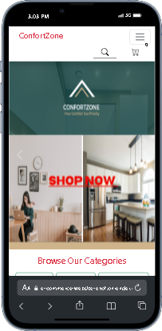

# E-Commerce-Website

E-Commerce-Website is a modern e-commerce web application built using Node.js, Vite, and React. It offers a seamless shopping experience for customers and a user-friendly interface for store owners to manage products and orders.

## Demo

## 

## Features

- **User Authentication**: Secure user authentication and authorization system.
- **Product Catalog**: Browse a wide range of products with detailed descriptions.
- **Shopping Cart**: Add and remove items from the cart before making a purchase.
- **User Profiles**: Allow users to create profiles, track orders, and manage personal information.
- **Admin Panel**: Admin dashboard to manage products, categories, and customer orders.
- **User Panel**: User dashboard to see its products,orders.

## E-Commerce-Website

- **Frontend**: React, CRA, JavaScript, HTML, CSS,bootstrap
- **Backend**: Node.js, Express.js and Rest Api etc
- **Database**: MongoDB (or any other database of your choice)
- **Authentication**: JSON Web Tokens (JWT)

## Prerequisites

- Node.js installed on your machine
- MongoDB database set up and running

# Tech Stack

- : A JavaScript library for building user interfaces.
- : Entry point for React rendering.
- : Declarative routing for React.
- : State management library for React applications.
- : Middleware for Redux to handle asynchronous actions.
- : DevTools extension for debugging Redux applications.
- : React UI library with a set of high-quality components.
- : Promise-based HTTP client for the browser and Node.js.
- : Zero-dependency module that loads environment variables from a `.env` file.
- : Icon library for React.
- : Animation library for React elements when they scroll into view.
- : React wrapper for ApexCharts, a modern charting library.
- : A composable charting library built on React components.
- : React wrapper for Chart.js, a simple yet flexible JavaScript charting for designers & developers.
- : Calendar component for React.
- : Datepicker component for React.
- : A document head manager for React.
- : Scroll component library for React.
- : Scroll to top button component for React.
- : React notification library.
- : Vertical timeline component for React.
- : React component for integrating WhatsApp into your web application.
- : Create a typewriter effect in React.
- : Modern JavaScript charting library.
- : Validate email addresses using a variety of methods.

**Project Images**

## Contributing

Contributions are welcome! If you'd like to contribute to this project, feel free to open an issue or submit a pull request.

## License

This project is licensed under the [MIT License](LICENSE).

---

## Feel free to customize the content according to your specific project details and requirements.
